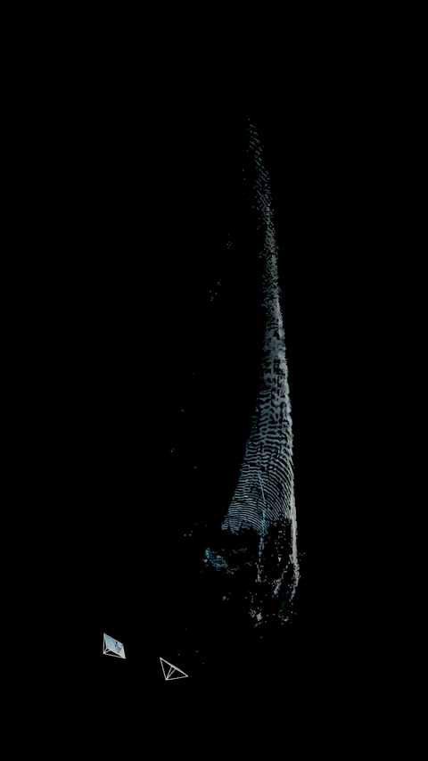
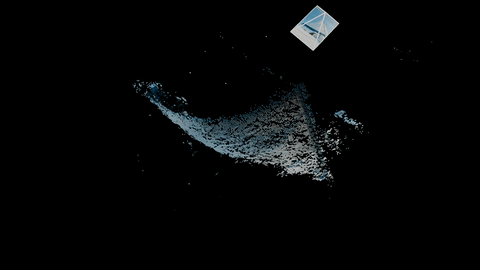
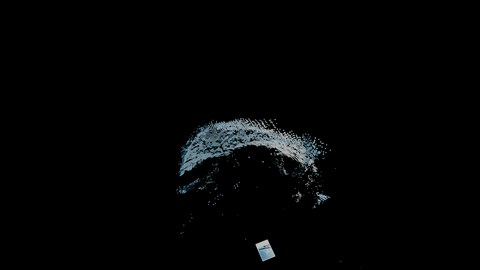
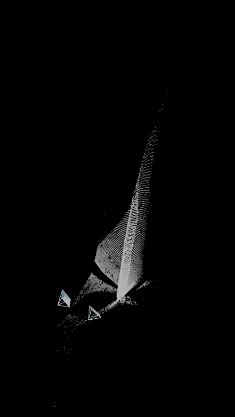

# Sail-CV

[](https://github.com/estebanfoucher/Sail-CV)
[](https://huggingface.co/estefoucher/tell-tale-detector)
[](https://creativecommons.org/licenses/by-nc-sa/4.0/)

## Looking is measuring : embedded computer vision measurement of sails aerodynamic performance.


This work introduces an embedded computer-vision framework that quantitatively measures
1.  3D sail geometry via a photogrammetry-based reconstruction method
2.  boundary-layer behavior through continuous tell-tale state tracking, and.

The two modules operate independently yet
share the same minimal hardware requirements, enabling practical, plug-and-play deployment across a broad
range of yachts.


---

## 3D Reconstruction Module

The 3D reconstruction module aims to recover accurate, metric point clouds of the sail surface from calibrated
stereo imagery. The method leverages two core components: (i) the ability of AI-based reconstruction models to
generate dense point correspondences between two viewpoints, and (ii) precise intrinsic and extrinsic calibration
of a general two-camera setup, enabling accurate triangulation and conversion of correspondences into 3D
coordinates. This approach eliminates the need for applied texture or detailed geometric priors on the sail.
The paper presents the details of the methods and the training of the tell-tale detector. Generic results taken
in real conditions on yachts are showed together with a more in-depth analysis of tell-tales on the rigid wings of
a model wind-powered vessel, comparing with another tell-tales detection method and pressure measurements.

### Example : mainsail sheeting

| Combined View (input)|
|:-------------:|
|  |

| Front View |
|:----------:|
|  |

| Bottom View | Top View |
|:-----------:|:--------:|
|  |  |

### Example : jibsail tacking

| Combined View (input)|
|:-------------:|
|  |

| Front View |
|:----------:|
|  |

| Bottom View | Top View |
|:-----------:|:--------:|
|  |  |

---

## Tell tales tracker module

The tell-tale tracking module uses a single-camera, detection-plus-tracking pipeline. A vision model trained on a purpose-built dataset (bounding boxes for attached, detached, and leech tell-tales) feeds a tracker that turns per-frame detections into time-series for aerodynamic interpretation. The approach is robust to variations in color, sail type, illumination, and motion.

### Model weights (detector & classifier)

Weights can be supplied in two ways:

- **Local path** — Put checkpoint files in `checkpoints/` (or another path) and set `model_path` in your parameters YAML (e.g. `parameters/default_classifier.yml`). Paths are resolved from the project root.
- **Hugging Face** — If a file is not found locally, the code tries to download it from [estefoucher/tell-tale-detector](https://huggingface.co/estefoucher/tell-tale-detector) (folder `weights/`). Use the exact filename in your config:
  - **Classifier:** `sailcv-yolo11n-cls224.pt`
  - **Detector:** `sailcv-rtdetrl1088.pt`, `sailcv-rtdetrl640.pt`

You can keep weights in `checkpoints/` or rely on automatic download by using these filenames in your config.

### User guide

To run the tracker on a new video, create a layout with the layout annotator, then run `analyze_video.py` with a chosen parameters file. **Get Started → Quick Start — Tell-Tales Tracking** below gives the full steps and example commands (layout creation, pipeline run, and config options).

## Get Started

### Prerequisites

- Python 3.10+
- [uv](https://docs.astral.sh/uv/) package manager
- ffmpeg
- CUDA-compatible GPU (recommended, required for real-time tracking)

### Installation

```bash
git clone https://github.com/estebanfoucher/sail-CV.git
cd sail-CV
git submodule update --init --recursive
```

Install Python dependencies:

```bash
uv sync --all-extras
```

Install ffmpeg:

```bash
# Ubuntu/Debian
sudo apt update && sudo apt install ffmpeg

# macOS
brew install ffmpeg
```


### Quick Start — 3D Reconstruction

Download model checkpoint:

```bash
mkdir -p checkpoints/

# MASt3R (3D reconstruction)
wget https://download.europe.naverlabs.com/ComputerVision/MASt3R/MASt3R_ViTLarge_BaseDecoder_512_catmlpdpt_metric.pth -P checkpoints/
```

Set up the Python path for reconstruction (run from project root):

```bash
export PYTHONPATH="${PWD}/src/reconstruction:${PWD}/mast3r:${PWD}/mast3r/dust3r"
```

Reconstruct a point cloud from a calibrated scene:

```bash
uv run python src/reconstruction/reconstruct_pair.py --scene scene_10
```

With more options:

```bash
uv run python src/reconstruction/reconstruct_pair.py \
  --scene scene_10 --render-cameras --save-matches --subsample 4
```

Launch the web interface:

```bash
uv run python web_app/main.py
```

### Quick Start — Tell-Tales Tracking

When you have a **new video and no layout** (e.g. `assets/tracking/DS_6/C4.mp4`), follow these two steps. All commands are run from the project root.

**Step 1: Create the layout**

Run the layout annotator (from project root):

```bash
uv run python src/tracking/annotate_layout_opencv.py \
  --video assets/tracking/DS_6/C4.mp4 \
  --time-sec 3 \
  --output output/tracking_layouts/DS_6/C4_layout.json
```

- **Left-click** on the frame to add a tell-tale position; the terminal will prompt for **id** (e.g. `TL`) and **name** (e.g. `top left`). Repeat for every tell-tale.
- **s** — save layout to the output file and exit.
- **q** or **Esc** — quit without saving.
- **u** — undo last point; **c** — clear all points.
- Optionally use `--direction dx dy` to set a direction prior in the JSON. Use `--frame N` instead of `--time-sec` to pick a frame by index.

**Step 2: Run the tracking pipeline**

Behavior (detector, classifier, masks, PCA arrows, output options) is controlled by the **parameters file**. The single entry point is `analyze_video.py`:

```bash
uv run python src/tracking/analyze_video.py \
  --video assets/tracking/DS_6/C4.mp4 \
  --layout output/tracking_layouts/DS_6/C4_layout.json
```

This uses the default config `parameters/default_classifier.yml` (bboxes + classifier labels, no masks/arrows). For masks and PCA arrows without the classifier, use `parameters/default_vector.yml`:

```bash
uv run python src/tracking/analyze_video.py \
  --video assets/tracking/DS_6/C4.mp4 \
  --layout output/tracking_layouts/DS_6/C4_layout.json \
  --parameters parameters/default_vector.yml
```

The `test_classif.yml` and `test_vector.yml` configs use fixture detections for fast runs (e.g. CI).

Output is written to `output/tracking/` by default (JSON plus optional tracking video and fgmask). Use `--output` to change the directory.

**Frame range:** By default all frames are processed (`--frame-start 0`, `--frame-end -1`; `-1` means last frame). To analyze only the first 10 frames (optionally with a specific config):

```bash
uv run python src/tracking/analyze_video.py --video assets/tracking/DS_6/C4.mp4 --layout output/tracking_layouts/DS_6/C4_layout.json --frame-start 0 --frame-end 9 --parameters parameters/default_vector.yml
```


**Parameters:** Files in `parameters/` (`default_classifier.yml`, `default_vector.yml`, and test configs) define the detector, classifier, crop module, and output options (main tracking video, mask overlay, PCA arrows). See `parameters/` for available configs.

If you already have a layout (e.g. from the fixtures):

```bash
uv run python src/tracking/analyze_video.py \
  --video fixtures/C1_fixture.mp4 \
  --layout fixtures/C1_layout.json
```

### Finetuning the detector

You can finetune the telltale detector on your own data by (1) creating a small annotated dataset with the annotator, (2) splitting it by source and reducing to one class, (3) fusing with the main Hugging Face dataset and training for a few epochs. The result is a 1-class (telltale) model you can use as the detector in the pipeline.

**Step 1: Create your custom dataset**

1. Open the annotation app in a browser: open `finetuning/annotator/index.html` from the project root (or serve the folder with any static server).
2. Load photos and/or videos. For videos, seek to a frame and click **Add current frame**; frames are named with a time prefix so they can be grouped by source when splitting.
3. Annotate bounding boxes and assign one of the three classes: **attached**, **detached**, **leech**.
4. Click **Export YOLO zip** and save the zip. It contains `images/`, `labels/`, and `data.yaml` (non-split, 3-class YOLO).

**Step 2: Split and reduce to one class**

Unzip the export, then run the split script so that images from the same video stay in the same split and all labels are reduced to a single class (`telltale`):

```bash
uv run python finetuning/split_yolo_by_source.py /path/to/export --output /path/to/custom_split
```

Optional: `--train-ratio 0.8` (default), `--seed 42` for reproducibility.

Output: `custom_split/train/`, `custom_split/val/`, and `data.yaml` with `nc: 1`, `names: ['telltale']`.

**Step 3: Finetune**

1. Open `finetuning/finetune_rtdetr.ipynb` (e.g. in Colab or locally with Jupyter).
2. Run the cells in order. On Colab, when prompted, upload the zip of your **split** custom dataset (the folder produced in Step 2, zipped).
3. The notebook will: download the main dataset from [estefoucher/sail-cv-telltales](https://huggingface.co/datasets/estefoucher/sail-cv-telltales), reduce it to one class if needed, fuse it with your custom data, download the 640 checkpoint from [estefoucher/tell-tale-detector](https://huggingface.co/estefoucher/tell-tale-detector), and train for 10–15 epochs (configurable in the notebook).
4. Best weights are saved under `runs/train/finetune_rtdetr/weights/best.pt`.

**Step 4: Use the new weights**

Point `model_path` in your parameters YAML to the new checkpoint (e.g. `runs/train/finetune_rtdetr/weights/best.pt`), or copy that file to `checkpoints/` and reference it by name.

### Docker

For containerized deployment on Jetson hardware:

```bash
cd docker/
docker compose build
docker compose up -d
```

### Development

```bash
uv sync --all-extras --group dev   # Install all dependencies
uv run pytest tests/               # Run full test suite
uv run ruff check src/ tests/      # Lint
uv run ruff format src/ tests/     # Format
```


---


## Acknowledgments

This project builds upon the excellent work of [MASt3R](https://github.com/naver/mast3r) (Grounding Image Matching in 3D with MASt3R) by Naver Labs.


## License

This project is licensed under [CC BY-NC-SA 4.0](https://creativecommons.org/licenses/by-nc-sa/4.0/) (Creative Commons Attribution-NonCommercial-ShareAlike 4.0), consistent with the [MASt3R](https://github.com/naver/mast3r) license from Naver Corporation.

See [LICENSE](LICENSE) for full details.
