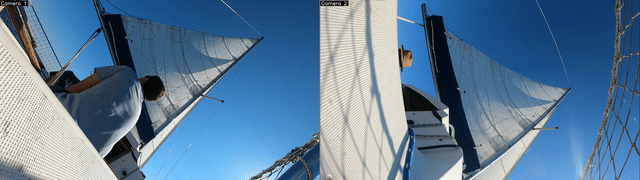
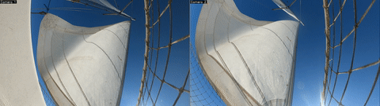
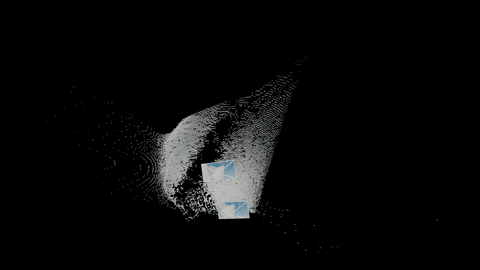
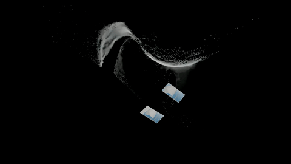

# SailCV-3D-reconstruction : calibrated stereo-view 3D dense reconstruction

## Overview

The present work aims to precisely reconstruct metric point clouds from calibrated stereo views. To do so, we leverage two main ingredients :
   - the ability of recent 3D reconstruction AI models (in that case mast3r) to predict
   **dense point matching** between two viewpoints of a same object
   - the precise **calibration** of intrinsics and extrinsics of a general two-camera setup to make precise **triangulation**

Below are two examples of results, applied to boatsail measurement.

### Example : mainsail sheeting

| Combined View (input)|
|:-------------:|
|  |

| Front View |
|:----------:|
|  |

| Bottom View | Top View |
|:-----------:|:--------:|
|  |  |

### Example : jibsail tacking

| Combined View (input)|
|:-------------:|
|  |

| Front View |
|:----------:|
|  |

| Bottom View | Top View |
|:-----------:|:--------:|
|  |  |

## Table of Contents

- [Overview](#overview)
- [Examples](#mainsail-sheeting)
  - [Mainsail sheeting](#mainsail-sheeting)
  - [Jibsail tacking](#jibsail-tacking)
- [Get Started](#get-started)
  - [Prerequisites](#prerequisites)
  - [Installation](#installation)
  - [Quick Start](#quick-start)
  - [Docker (Alternative)](#docker-alternative)
- [Development Setup (optional)](#development-setup-optional)
- [Acknowledgments](#acknowledgments)

## Get Started

### Prerequisites

- Python 3.10+
- [uv](https://docs.astral.sh/uv/) package manager
- ffmpeg
- optional : CUDA-compatible GPU (recommended for optimal performance)

### Installation

1. **Clone the repository**
   ```bash
   git clone https://github.com/estebanfoucher/SailCV-3D-reconstruction
   cd SailCV-3D-reconstruction
   ```

2. **Install dependencies**

   set up python:
   ```bash
   uv sync
   ```
   install ffmpeg:
   ```bash
   # Ubuntu/Debian
   sudo apt update && sudo apt install ffmpeg

   # MacOS
   brew install ffmpeg
   ```

3. **Activate environment**
   ```bash
   source .venv/bin/activate
   ```

4. **Add external module to python environment**
   ```bash
   export PYTHONPATH="${PWD}/mast3r:${PWD}/mast3r/dust3r:${PWD}/pow3r:${PWD}/pow3r/dust3r:${PYTHONPATH}"
   ```
   Note: Run this command from the project root directory

5. **Download model to checkpoints/**

```bash
mkdir -p checkpoints/
wget https://download.europe.naverlabs.com/ComputerVision/MASt3R/MASt3R_ViTLarge_BaseDecoder_512_catmlpdpt_metric.pth -P checkpoints/
```

### Quick Start

**Web Interface (Recommended)**
```bash
cd web_app
python main.py
```
Open your browser to `http://localhost:{PORT}` to access the interactive web interface. The port is defined in the .env

### Docker (Alternative)

For containerized deployment, especially on Jetson hardware (tested on jetson nano):

```bash
cd docker/
docker compose build
docker compose -f docker-compose.yml up -d
docker compose -f docker-compose.yml exec sailcv-3d-reconstruction bash
cd app/web_app/
python3 main.py
```

## Development Setup (optional)

```bash
make dev          # Install dependencies and setup development environment
make check         # Run all code quality checks
make test          # Run test suite
```

## Acknowledgments

This project builds upon the excellent work of [MASt3R](https://github.com/naver/mast3r) (Grounding Image Matching in 3D with MASt3R) by Naver Labs.
